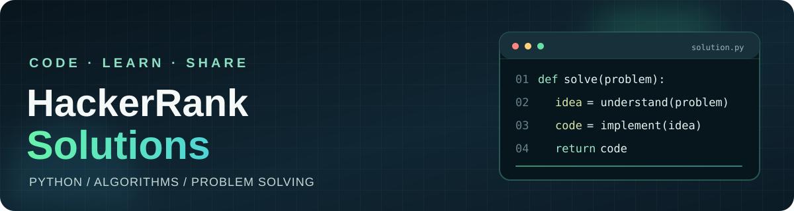

  

# HackerRank Python Solutions

Readable Python solutions to [HackerRank](https://www.hackerrank.com/profile/singhshubhagaman) challenges, with direct links to each problem and short notes on the approach. The solutions are grouped by category and difficulty so you can find a challenge quickly.

  
  

**Jump to:** [Challenge index](#challenge-index) · [Approach notes](#approach-notes) · [Connect](#connect)

## Challenge index

| ID | Challenge | Category | Difficulty | Problem | Code |
| --- | --- | --- | --- | --- | --- |
| 001 | [Between Two Sets](https://www.hackerrank.com/challenges/between-two-sets/problem) | Algorithms | Easy | [Summary](algorithms/easy/between-two-sets/problem.md) | [Python solution](algorithms/easy/between-two-sets/solution.py) |
| 002 | [Breaking the Records](https://www.hackerrank.com/challenges/breaking-best-and-worst-records/problem) | Algorithms | Easy | [Summary](algorithms/easy/breaking-best-and-worst-records/problem.md) | [Python solution](algorithms/easy/breaking-best-and-worst-records/solution.py) |

## Approach notes

- **Between Two Sets:** Find the least common multiple of the first array and the greatest common divisor of the second. Count the multiples of the first value that divide the second.
- **Breaking the Records:** Keep track of the highest and lowest score seen so far, updating the two counters whenever a new record appears.

Each challenge title opens the original HackerRank problem. The summary and solution links open the corresponding files in this repository.

## About the author

I'm **Shubhagaman Singh**, a Junior Research Assistant at Sharda University. I build AI, full-stack, mobile, and IoT projects, and I use coding challenges to keep sharpening my problem-solving skills. You can see more of my work on my [portfolio](https://shubhagaman.in/).

## Connect

[Portfolio](https://shubhagaman.in/) · [GitHub](https://github.com/ShubhagamanSingh) · [LinkedIn](https://www.linkedin.com/in/shubhagaman-singh) · [ORCID](https://orcid.org/0009-0006-5021-2337) · [X](https://twitter.com/Shubhagaman_) · [Instagram](https://instagram.com/shubhagaman_singh) · [Email](mailto:shubhagamansingh@gmail.com)
